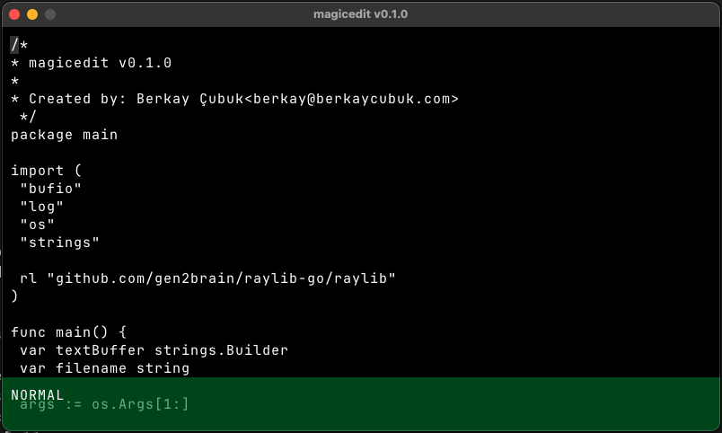

# magicedit

magicedit is an experimental project, and it's highly influenced by projects like [Acme](http://acme.cat-v.org/) and [Vim](https://www.vim.org/).

## Motivation

> "I always loved to try building existing solutions. This time I try to build the code editor I'll want to use. My goal is to not win a marketshare or make money, I just want to experiment, and learn new things along the journey."
> Berkay

## Development

- `go get` to install libraries.
- `go run .` to run the editor.
